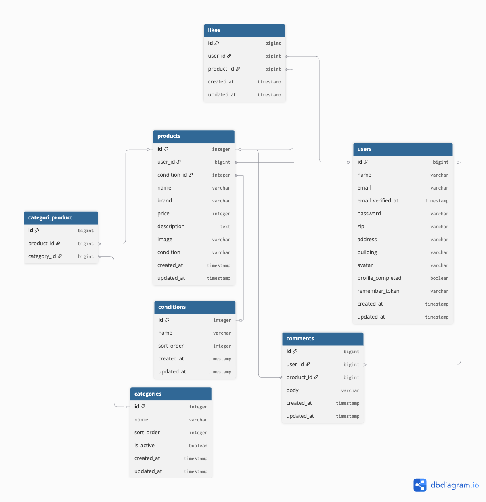

# SPAフリマアプリ

Laravelで構築したAPIとNuxtを使用したSPA構成のフリマアプリケーションです。
　　　　　　　　　　　　　　　　　　　　　　　　　　　　　　　　　　　　　　　　　　　　　　　　　　　　　　　　　　　　　　　　　　　　　　　　　　　　　　　　　　　　　　　　　　　　　　　　　　
## 環境構築

## 1.リポジトリをクローン
 - git clone https://github.com/qurow403/test13-.git
　　　　　　　　　　　　　　　　　　　　　　　　　　　　　　　　　　　　　　　　　　　　　　　　　
　　　　　　　　　　　　　　　　　　　　　　　　　　　　　　　　　　　　　　　　　　　　　　　　　
## 2.backend (Laravel)
 - cd backend
 - composer install
 - cp .env.example .env    .envファイル作成
 - php artisan key:generate
 - php artisan migrate
 - php artisan db:seed
 - php artisan serve    サーバー起動
 - php artisan test    テスト実行
　　　　　　　　　　　　　　　　　　　　　　　　　　　　　　　　　　　　　　　　　　　　　　　　　
　　　　　　　　　　　　　　　　　　　　　　　　　　　　　　　　　　　　　　　　　　　　　　　　　
## 3.frontend (Nuxt)
 - cd frontend
 - npm install
 - npm run dev
　　　　　　　　　　　　　　　　　　　　　　　　　　　　　　　　　　　　　　　　　　　　　　　　　　　　　　　　　　　　　　　　　　　　　　　　　　　　　　　　　　　　　　　　　　　　　　　　　　
## 開発環境

### フロントエンド

- http://localhost:3000

### APIサーバー

- http://localhost:8000/api
　　　　　　　　　　　　　　　　　　　　　　　　　　　　　　　　　　　　　　　　　　　　　　　　　
　　　　　　　　　　　　　　　　　　　　　　　　　　　　　　　　　　　　　　　　　　　　　　　　　
 ## 認証関連
 - 会員登録画面
   http://localhost:3000/register

 - ログイン画面
   http://localhost:3000/login

 - メール認証画面
   http://localhost:3000/email/verify/{id}/{hash}
　　　　　　　　　　　　　　　　　　　　　　　　　　　　　　　　　　　　　　　　　　　　　　　　　
　　　　　　　　　　　　　　　　　　　　　　　　　　　　　　　　　　　　　　　　　　　　　　　　　
 ## 商品機能
 - 商品一覧画面
   http://localhost:3000/

 - 商品詳細画面
   http://localhost:3000/products/{id}

 - 商品購入画面
   http://localhost:3000/products/{id}/purchase

 - 商品出品画面
   http://localhost:3000/products/sell
　　　　　　　　　　　　　　　　　　　　　　　　　　　　　　　　　　　　　　　　　　　　　　　　　
　　　　　　　　　　　　　　　　　　　　　　　　　　　　　　　　　　　　　　　　　　　　　　　　　
 ## ユーザー機能
 - プロフィール画面
   http://localhost:3000/profile

 - プロフィール編集画面
   http://localhost:3000/profile/setup
　　　　　　　　　　　　　　　　　　　　　　　　　　　　　　　　　　　　　　　　　　　　　　　　　
　　　　　　　　　　　　　　　　　　　　　　　　　　　　　　　　　　　　　　　　　　　　　　　　　
　　　　　　　　　　　　　　　　　　　　　　　　　　　　　　　　　　　　　　　　　　　　　　　　　
## 使用技術 (実行環境)

## フロントエンド
 - Nuxt 4.2.2
 - Vue 3.5.26
 - vee-validate 4.15.1
 - yup 1.7.1
 - CSS
　　　　　　　　　　　　　　　　　　　　　　　　　　　　　　　　　　　　　　　　　　　　　　　　　
　　　　　　　　　　　　　　　　　　　　　　　　　　　　　　　　　　　　　　　　　　　　　　　　　
## バックエンド
 - Laravel 12
 - Laravel Sanctum
　　　　　　　　　　　　　　　　　　　　　　　　　　　　　　　　　　　　　　　　　　　　　　　　　
　　　　　　　　　　　　　　　　　　　　　　　　　　　　　　　　　　　　　　　　　　　　　　　　　
## データベース
 - SQLite
　　　　　　　　　　　　　　　　　　　　　　　　　　　　　　　　　　　　　　　　　　　　　　　　　
　　　　　　　　　　　　　　　　　　　　　　　　　　　　　　　　　　　　　　　　　　　　　　　　　
## 開発ツール
 - MailHog
　　　　　　　　　　　　　　　　　　　　　　　　　　　　　　　　　　　　　　　　　　　　　　　　　
　　　　　　　　　　　　　　　　　　　　　　　　　　　　　　　　　　　　　　　　　　　　　　　　　
## ER図

　　　　　　　　　　　　　　　　　　　　　　　　　　　　　　　　　　　　　　　　　　　　　　　　　
　　　　　　　　　　　　　　　　　　　　　　　　　　　　　　　　　　　　　　　　　　　　　　　　　
### メール認証画面の文言・挙動について
本アプリは SPA（Single Page Application）構成のため、
メール認証は「メール内の認証リンクをユーザーが別タブで開く」フローになります。

そのため、メール認証画面では以下のような設計としています。

- 「認証はこちらから（認証メールを確認する）」
  実際に認証を行うボタンではなく、メールクライアント（開発環境では MailHog）を開くための導線

SPA ではメールリンククリック後の状態変化を自動で検知できないため、
ユーザーに明示的な確認操作を促す UI としています。

MailHog
http://0.0.0.0:8025
